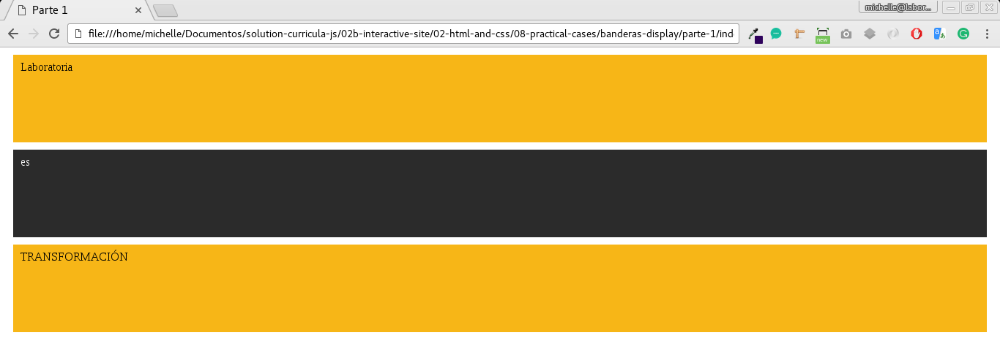
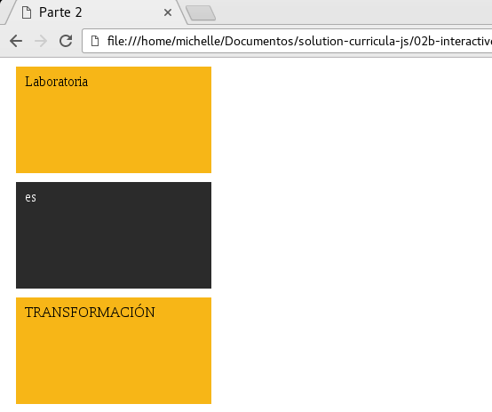

## DESCRIPCION DE EJERCICIO BANDERAS DISPLAY

### INSTRUCCIONES

Replica las siguientes vistas poniendo en práctica tus conocimientos de display. Debes utilizar únicamente display, no puedes utilizar positioning ni floats.

